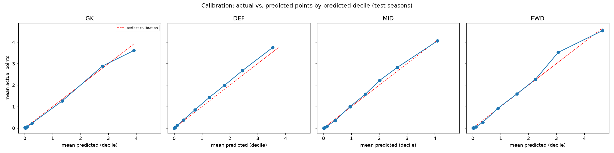
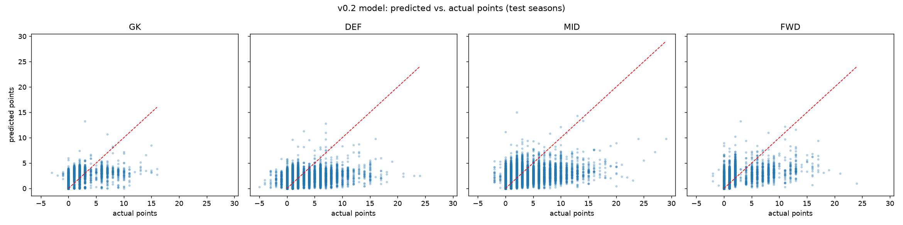
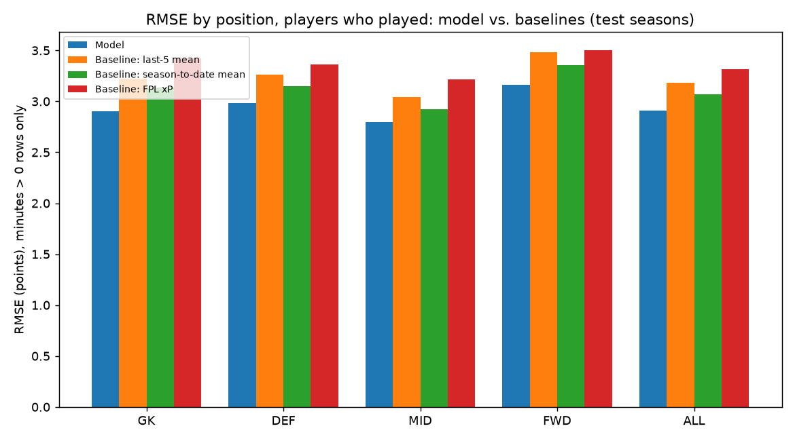
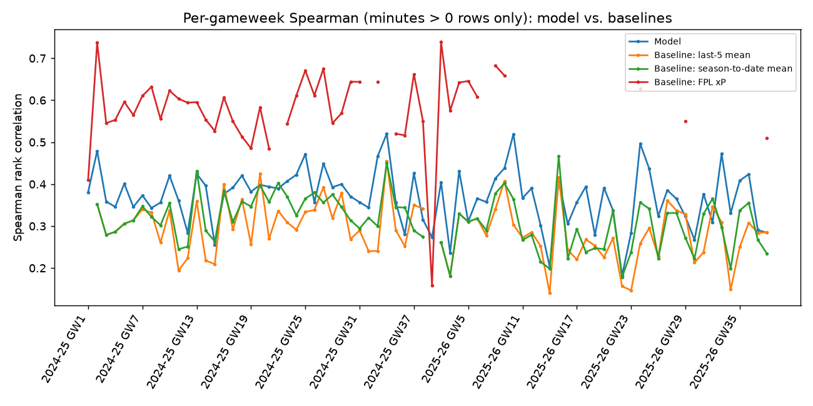
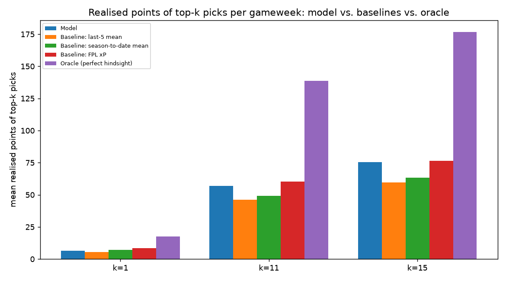

# FPL Expected-Points Backtest -- v0.2

**v0.1's original report is preserved unmodified at [reports/backtest_v0.1.md](backtest_v0.1.md)** -- see docs/leakage-audit.md for why it wasn't touched (no leakage found, so no correction was needed).

Train seasons: 2020-21, 2021-22, 2022-23
Validation season (Phase 3 model selection): 2023-24
Test seasons: 2024-25, 2025-26 (frozen -- touched exactly once, here, for this report)

Selected model: **`pooled`**, chosen by the pre-committed rule in docs/evaluation-plan.md on validation only -- see reports/validation_comparison.md for the comparison. Refit on train+validation combined before this one test run.

Test rows: 57,026 (22,792 with minutes > 0)

## Metrics: all rows vs. excluding blanks vs. minutes > 0 only

Three cuts, per docs/judgment-calls.md: **all rows** (includes the synthetic `is_blank` rows created by reindexing each player to a complete calendar-gameweek grid -- these have a trivially-predictable target of 0, so this column is NOT a fair comparison against v0.1, which never had blank rows at all); **excluding is_blank rows** (real rows only -- an unused sub or a not-yet-debuted player still counts, only the synthetic reindexed gameweeks are dropped -- this is the column comparable to v0.1); and **minutes > 0 only** (restricted further to players who actually featured -- a real but different skill from correctly predicting a non-player's ~0, and the one closest to "could this have informed a squad pick"). A gameweek slate is only used for a method's Spearman average if every method being compared has a defined (non-degenerate) correlation on it -- see `n_gw_dropped` --  so the averages are over the same gameweeks for every method, not silently different sets.

**Why so many gameweeks are dropped from the Spearman average (30 of 76 test gameweeks from `baseline_xp` alone, plus each test season's own gameweek 1, where `baseline_last5`/`baseline_season` are still a constant fallback value with no rolling history yet -- by design, not a bug):** `baseline_xp` (FPL's own `xP`) is a single constant value across the entire slate in 30 test gameweeks -- a source data-quality gap in the upstream dump, concentrated in the most recent gameweeks of the in-progress season (presumably not yet backfilled at pull time), not a bug in this pipeline. Match results, minutes, and points are unaffected -- only `xP` itself is missing for those rounds. See docs/judgment-calls.md #14.

| method | position | rmse | mae | spearman | n | n_gw_dropped | rmse_nonblank | mae_nonblank | spearman_nonblank | n_nonblank | n_gw_dropped_nonblank | rmse_played | mae_played | spearman_played | n_played | n_gw_dropped_played |
| --- | --- | --- | --- | --- | --- | --- | --- | --- | --- | --- | --- | --- | --- | --- | --- | --- |
| Model | DEF | 1.9809 | 1.0402 | 0.6484 | 18879 | 32 | 1.9943 | 1.0544 | 0.6483 | 18625 | 32 | 2.9837 | 2.0362 | 0.3018 | 7649 | 32 |
| Baseline: last-5 mean | DEF | 2.2056 | 1.1633 | 0.611 | 18879 | 32 | 2.2011 | 1.1585 | 0.6158 | 18625 | 32 | 3.2592 | 2.311 | 0.209 | 7649 | 32 |
| Baseline: season-to-date mean | DEF | 2.1457 | 1.167 | 0.5962 | 18879 | 32 | 2.1481 | 1.165 | 0.6005 | 18625 | 32 | 3.1515 | 2.1884 | 0.2276 | 7649 | 32 |
| Baseline: FPL xP | DEF | 2.1762 | 1.0341 | 0.7097 | 18879 | 32 | 2.191 | 1.0482 | 0.7095 | 18625 | 32 | 3.3597 | 2.2857 | 0.5495 | 7649 | 32 |
| Model | FWD | 2.15 | 1.1092 | 0.7497 | 6294 | 32 | 2.1629 | 1.1226 | 0.7502 | 6219 | 32 | 3.1596 | 2.1175 | 0.5054 | 2670 | 32 |
| Baseline: last-5 mean | FWD | 2.3811 | 1.1924 | 0.7446 | 6294 | 32 | 2.3801 | 1.1884 | 0.7499 | 6219 | 32 | 3.4802 | 2.3488 | 0.4246 | 2670 | 32 |
| Baseline: season-to-date mean | FWD | 2.3282 | 1.2223 | 0.7136 | 6294 | 32 | 2.3259 | 1.2166 | 0.7178 | 6219 | 32 | 3.3568 | 2.2643 | 0.4553 | 2670 | 32 |
| Baseline: FPL xP | FWD | 2.3193 | 1.076 | 0.8081 | 6294 | 32 | 2.3332 | 1.0889 | 0.8079 | 6219 | 32 | 3.5052 | 2.3503 | 0.6562 | 2670 | 32 |
| Model | GK | 1.504 | 0.6692 | 0.6783 | 6296 | 32 | 1.5144 | 0.6785 | 0.6798 | 6210 | 32 | 2.9012 | 2.1545 | 0.1141 | 1517 | 32 |
| Baseline: last-5 mean | GK | 1.6863 | 0.7191 | 0.7616 | 6296 | 32 | 1.6805 | 0.7151 | 0.7655 | 6210 | 32 | 3.2255 | 2.4083 | 0.0753 | 1517 | 32 |
| Baseline: season-to-date mean | GK | 1.6544 | 0.7446 | 0.7221 | 6296 | 32 | 1.6547 | 0.7429 | 0.7258 | 6210 | 32 | 3.1375 | 2.3015 | 0.0957 | 1517 | 32 |
| Baseline: FPL xP | GK | 1.747 | 0.7573 | 0.7198 | 6296 | 32 | 1.7591 | 0.7677 | 0.7202 | 6210 | 32 | 3.4217 | 2.4759 | 0.4524 | 1517 | 32 |
| Model | MID | 1.9226 | 0.9573 | 0.7318 | 25557 | 32 | 1.9361 | 0.9708 | 0.7317 | 25203 | 32 | 2.7933 | 1.7307 | 0.4092 | 10956 | 32 |
| Baseline: last-5 mean | MID | 2.1242 | 1.0624 | 0.7124 | 25557 | 32 | 2.1182 | 1.0575 | 0.7168 | 25203 | 32 | 3.0434 | 1.9808 | 0.3472 | 10956 | 32 |
| Baseline: season-to-date mean | MID | 2.0651 | 1.075 | 0.6845 | 25557 | 32 | 2.0655 | 1.072 | 0.6887 | 25203 | 32 | 2.9225 | 1.8577 | 0.3623 | 10956 | 32 |
| Baseline: FPL xP | MID | 2.1388 | 0.9918 | 0.7959 | 25557 | 32 | 2.1537 | 1.0058 | 0.7954 | 25203 | 32 | 3.2143 | 2.1048 | 0.6046 | 10956 | 32 |
| Model | ALL | 1.9276 | 0.9697 | 0.7102 | 57026 | 32 | 1.9407 | 0.9829 | 0.7105 | 56257 | 32 | 2.91 | 1.9067 | 0.3791 | 22792 | 32 |
| Baseline: last-5 mean | ALL | 2.1383 | 1.0722 | 0.6935 | 57026 | 32 | 2.1335 | 1.0676 | 0.6981 | 56257 | 32 | 3.1826 | 2.1632 | 0.3053 | 22792 | 32 |
| Baseline: season-to-date mean | ALL | 2.0823 | 1.0852 | 0.6686 | 57026 | 32 | 2.0831 | 1.0824 | 0.6729 | 56257 | 32 | 3.0682 | 2.0459 | 0.3231 | 22792 | 32 |
| Baseline: FPL xP | ALL | 2.1327 | 0.9892 | 0.7659 | 57026 | 32 | 2.1473 | 1.0027 | 0.7657 | 56257 | 32 | 3.3125 | 2.2189 | 0.5945 | 22792 | 32 |

## Decision metric: precision@k and realised points of top-k (unconstrained)

Within each gameweek's slate, the model's/baseline's top-k predicted players vs. the actual top-k by real points, and how many points those top-k picks actually returned -- compared against an oracle (perfect hindsight) as the theoretical ceiling. **Unconstrained: no budget, no formation, no per-club limit.** That makes k=1 (captaincy) a genuine decision -- you already own your squad, so picking who to captain really is "best predicted score today," no constraints attached. It does NOT make k=11/15 a realistic squad: with no budget or club cap this can and does pick five players from one club. Treat k=11/15 here as an upper bound on ranking quality, not a proposed XI -- see the constrained version immediately below for that.

| method | k | precision_at_k | realised_points_of_topk |
| --- | --- | --- | --- |
| Model | 1 | 0.0263 | 6.4605 |
| Model | 11 | 0.1531 | 56.8684 |
| Model | 15 | 0.1781 | 75.2895 |
| Baseline: last-5 mean | 1 | 0.0395 | 5.3158 |
| Baseline: last-5 mean | 11 | 0.1005 | 46.0921 |
| Baseline: last-5 mean | 15 | 0.1114 | 59.6711 |
| Baseline: season-to-date mean | 1 | 0.0789 | 7.0263 |
| Baseline: season-to-date mean | 11 | 0.1304 | 49.0789 |
| Baseline: season-to-date mean | 15 | 0.1404 | 63.1974 |
| Baseline: FPL xP | 1 | 0.1053 | 8.4737 |
| Baseline: FPL xP | 11 | 0.2045 | 60.1842 |
| Baseline: FPL xP | 15 | 0.2237 | 76.5921 |
| Oracle (perfect hindsight) | 1 | 1.0 | 17.6053 |
| Oracle (perfect hindsight) | 11 | 1.0 | 138.6184 |
| Oracle (perfect hindsight) | 15 | 1.0 | 176.8553 |

## Decision metric: constrained top-11 (budget + formation + 3-per-club)

One XI per gameweek, built greedily by predicted value within a fixed 1GK-4DEF-4MID-2FWD formation, a GBP100.0m budget, and a max of 3 players from any one club -- see docs/judgment-calls.md for why the formation is fixed rather than searched, and why the fill is greedy rather than a global optimum. `n_gameweeks_feasible` is how many of the test gameweeks had an affordable, legal XI at all under that predictor's rankings.

| mean_realised_points | mean_predicted_points | mean_spend | n_gameweeks_feasible | n_gameweeks_total | method |
| --- | --- | --- | --- | --- | --- |
| 53.55 | 56.6 | 839.28 | 76 | 76 | Model |
| 43.87 | 77.95 | 734.87 | 76 | 76 | Baseline: last-5 mean |
| 45.42 | 65.89 | 839.04 | 76 | 76 | Baseline: season-to-date mean |
| 60.99 | 54.18 | 703.75 | 76 | 76 | Baseline: FPL xP |
| 132.7 | 132.7 | 664.43 | 76 | 76 | Oracle (perfect hindsight) |

## Calibration

Mean actual points by predicted-points decile, per position. Systematic under-prediction in the top decile is the failure mode that breaks captaincy picks.

## Plots

## Verdict

- **RMSE (minutes > 0):** model beats the best baseline (2.910 vs 3.068, Baseline: season-to-date mean). Paired bootstrap over 76 gameweeks: mean diff -0.150 (95% CI [-0.194, -0.110], SE 0.022) -- negative means the model's RMSE is lower (better); the CI excluding 0 means this isn't noise.
- **Spearman (minutes > 0): model does NOT beat the best baseline** (0.379 vs 0.594, Baseline: FPL xP). Reported as-is rather than tuned away. Paired bootstrap: mean diff -0.204 (95% CI [-0.226, -0.180]) -- excludes 0, so this is a real gap, not noise.
- **Constrained top-11 (budget + formation + 3-per-club), realised points:** model 53.6 pts/gameweek vs. 61.0 for the best baseline and 132.7 for the oracle (feasible in 76/76 test gameweeks).
- **Top-11 realised points, unconstrained (budget/formation/club-agnostic -- see the constrained version above for the number that actually respects squad rules):** model's top-11 picks average 56.9 points/gameweek, vs. 60.2 for the best baseline and 138.6 for a perfect-hindsight oracle.
