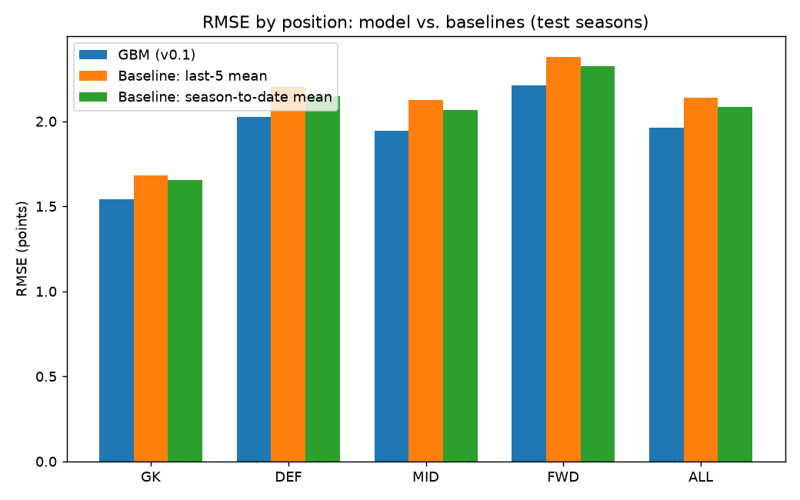
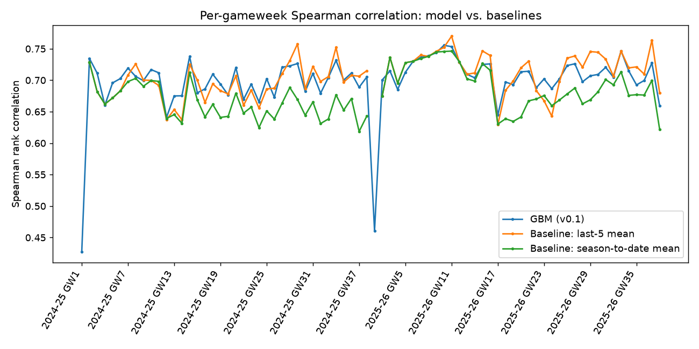

# FPL Expected-Points Backtest

Train seasons: 2020-21, 2021-22, 2022-23, 2023-24
Test seasons: 2024-25, 2025-26 (held out, evaluated only once)

Train rows: 99,818 | Test rows: 56,257

## Leakage handling

- Every rolling/form feature (points, minutes, ICT, goals, assists, bps, bonus, clean sheets, goals conceded, saves, starts, team goals for/against) is computed as `shift(1)` within its (season, player) or (season, team) group **before** any rolling window or expanding mean is applied, so a gameweek's features only see strictly earlier gameweeks.
- Fixture difficulty, home/away, scheduled fixture count, and price are used unshifted: FPL sets these before kickoff and they don't depend on the match's outcome, so there is nothing to leak.
- `xP` (FPL's own pre-match expected points for that same gameweek) is **dropped entirely**, not shifted, because even lagged by one gameweek it would be injecting a competing model's prediction for a different player-gameweek as a feature. See QUESTIONS.md.

## Metrics (test seasons)

| method | position | rmse | mae | spearman | n |
| --- | --- | --- | --- | --- | --- |
| GBM (v0.1) | DEF | 2.0259 | 1.0465 | 0.6315 | 18625 |
| GBM (v0.1) | FWD | 2.211 | 1.1173 | 0.7424 | 6219 |
| GBM (v0.1) | GK | 1.5432 | 0.6686 | 0.6895 | 6210 |
| GBM (v0.1) | MID | 1.9456 | 0.9782 | 0.7185 | 25203 |
| GBM (v0.1) | ALL | 1.9642 | 0.982 | 0.6982 | 56257 |
| Baseline: last-5 mean | DEF | 2.2025 | 1.1641 | 0.623 | 18625 |
| Baseline: last-5 mean | FWD | 2.3807 | 1.1945 | 0.7605 | 6219 |
| Baseline: last-5 mean | GK | 1.6819 | 0.7183 | 0.7887 | 6210 |
| Baseline: last-5 mean | MID | 2.1238 | 1.0643 | 0.7255 | 25203 |
| Baseline: last-5 mean | ALL | 2.1367 | 1.0735 | 0.7062 | 56257 |
| Baseline: season-to-date mean | DEF | 2.1487 | 1.1677 | 0.605 | 18625 |
| Baseline: season-to-date mean | FWD | 2.3263 | 1.2199 | 0.7255 | 6219 |
| Baseline: season-to-date mean | GK | 1.6548 | 0.7451 | 0.739 | 6210 |
| Baseline: season-to-date mean | MID | 2.066 | 1.0743 | 0.6919 | 25203 |
| Baseline: season-to-date mean | ALL | 2.0836 | 1.085 | 0.6774 | 56257 |

## Verdict

- **RMSE/MAE:** the model beats the best naive baseline overall (1.964 vs 2.084 RMSE, method: Baseline: season-to-date mean), and on RMSE in every individual position too (see the RMSE-by-position plot).
- **Spearman rank correlation (what matters more for team selection than RMSE): the model does NOT win overall.** The last-5-mean baseline has a slightly higher average per-gameweek rank correlation (0.706 vs 0.698 for the model). This is reported as-is rather than tuned away.
- By position, the model's Spearman correlation is below the best baseline's for: GK, MID, FWD. It wins on RMSE/MAE in those same positions regardless, i.e. it is a better *point* predictor there but not a better *ranker* than simply using recent-form averages.
- Net read: the model is a clear, non-tuned win on point-estimate accuracy (RMSE/MAE) across every position, but it is not a uniform win on rank correlation, which is the metric that actually drives which 11-15 players you'd pick. A v0.2 iteration should focus on ranking quality (e.g. a pairwise/ranking loss, or the two-stage P(plays 60+) x points-if-played structure noted as a stretch goal) rather than further squeezing RMSE.

## Plots

## Top feature importances by position

**GK**

| feature | importance |
| --- | --- |
| mins_form3 | 0.3492 |
| bps_form5 | 0.2562 |
| num_fixtures | 0.0617 |
| pts_form3 | 0.0489 |
| bps_form3 | 0.0431 |
| value | 0.0322 |
| mins_season_avg | 0.0309 |
| ict_form3 | 0.0308 |

**DEF**

| feature | importance |
| --- | --- |
| bps_form3 | 0.2791 |
| mins_form3 | 0.232 |
| ict_form3 | 0.1101 |
| num_fixtures | 0.0838 |
| fixture_difficulty | 0.0625 |
| pts_season_avg | 0.0544 |
| value | 0.0477 |
| bps_form5 | 0.0133 |

**MID**

| feature | importance |
| --- | --- |
| ict_form3 | 0.2708 |
| mins_form3 | 0.2149 |
| pts_season_avg | 0.109 |
| ict_form5 | 0.0973 |
| value | 0.0802 |
| num_fixtures | 0.0711 |
| pts_form3 | 0.0675 |
| fixture_difficulty | 0.0154 |

**FWD**

| feature | importance |
| --- | --- |
| mins_form3 | 0.3004 |
| ict_form3 | 0.1901 |
| value | 0.0707 |
| num_fixtures | 0.0582 |
| ict_form5 | 0.0551 |
| pts_form3 | 0.051 |
| mins_season_avg | 0.0456 |
| pts_season_avg | 0.0435 |
